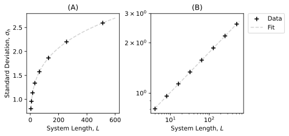
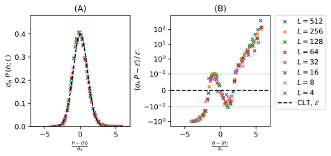
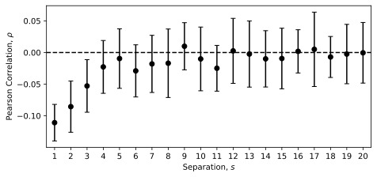
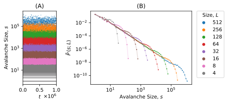
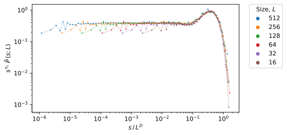

# Oslo

A Python implementation of the Oslo model of a simple system exhibiting self-organised criticality. Based on work done for a master's module in complexity theory and networks at Imperial College, with Prof. Kim Christensen, who originally proposed the Oslo model in his 1996 Nature paper [Christensen et al., 1996].

An abreviated version of the final paper can be read [here](https://github.com/bdgrichards/oslo/blob/b76f9ebb792a95588fffb9974e4b3ae503022653/Paper.pdf).

## Singular reference:

Frette, V., Christensen, K., Malthe-Sørenssen, A. et al. Avalanche dynamics in a pile of rice. Nature 379, 49–52 (1996). https://doi.org/10.1038/379049a0

## Figures

Which won't mean much, without reading that paper...

---

Height as a function of time plotted on linear-linear (A) and log-log (B) axes, for systems of various sizes, $L$. Each system has a transient growth phase followed by steady-state. In (B), transient phase height follows a power law and steady-state heights are evenly spaced, indicating a linear relationship between steady-state height and system size $L$, which changes by a factor of 2 between measured system sizes. Small systems exhibit noise from the discretisation of pile height.

---

Cross over times for various system sizes, on linear-linear (A) and log-log (B) axes, with a fit of $a x^2$ matching the data well. Errors were not added since they would be too small to see, ranging from 0.4 for $L=4$ to 442 for $L=512$.

---

A data collapse of average pile height $\tilde{h}$ over 20 repetitions as a function of system size, $L$, and time. $t$, plotted on linear-linear (A) and log-log axes (B), together with a fit of the predicted form of the scaling function to the $L=512$ data. This clearly shows the transient and steady-state phases of the scaling function, as well as verifying its predicted form.

---

Time averaged pile height against system length, together with the average height scaling relation including corrections to scaling terms (A) and the average height with leading order removed against system length, showing the corrections to scaling, and the asymptotic average gradient, $a_0$ (B). Errors were not added to either plot, since they would be too small to see, with values for plot (A) ranging from $8.4 \times 10^{-4}$ for $L=4$ to $2.6 \times 10^{-3}$ for $L=512$. The processed data shown in (B) were used in a multi-parameter curve fit to find the corrections to scaling parameters, which were then plotted in Figure (A) for verification against the raw data.

---

Standard deviation of time-averaged pile height against system length on linear-linear (A) and log-log (B) axes, together with a power law fit which agrees very well with the data. Errors were not added to plots, since they would be too small to see, with values ranging from $5.7 \times 10^{-4}$ for $L=4$ to $1.8 \times 10^{-3}$ for $L=512$.

---

Normalised pile height probability distributions against pile height, for various system sizes. As expected, we find maximum probability density to decrease with increasing pile height, due to previous findings of increasing standard deviation on the mean pile height with increasing system size.

---

Collapsing the pile height probability distributions onto the the Gaussian expected by the central limit theorem (abreviated CLT) (A), and the fractional difference between the measured and expected (abreviated $\mathcal{E}$) values (B). Note the symmetric log axis on (B) with limits of $\pm 0.1$, within which the graph becomes linear, marked by grey lines, to display negative values. The data clearly do not fall evenly about 0, instead showing the shifted mean and asymmetric tails characteristic of a normalised, positively skewed, Gaussian-like distribution.

---

The Pearson product-moment correlation coefficient, $\rho$, between gradients of sites of a given separation, $s$, averaged over the $t=L^2$ gradients of 20 instances, for $L=512$. Sites of separation 1 are adjacent, and non-zero correlation is observed between sites for separations less than 3.

---

Avalanche size over time (A) and probability distribution of avalanche size against avalanche size on logarithmic axes (B) for various system sizes. Larger system sizes produce larger avalanches, with the probability distributions following a common scaling region following a power law, followed by an $L$-dependent cutoff.

---

Collapsing the avalanche probabilities of various system sizes onto the scaling function proposed by the finite scaling ansatz. Sizes $L=4$ and $8$ are omitted, since the finite scaling ansatz is only valid for $L \gg 1$, and they do not lie on the same data collapse as the other system sizes. The collapse is of good quality, indicating the validity of the finite scaling ansatz equation for this system.

---

The first, second, third and fourth moments of $s$, against system size $L$, with each moment fitted to a power law (A) and the exponents of the resulting power laws for each moment, plotted against moment number, with linear regression to find the avalanche dimension $D$ and the avalanche-size exponent $\tau_s$ (B). Errors have not been included in (B) as they would be too small to see, with values ranging from $2.6 \times 10^{-3}$ for $k=1$ to $2.7 \times 10^{-4}$ for $k=4$.
